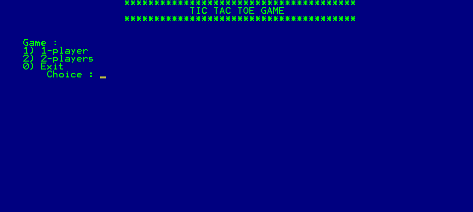
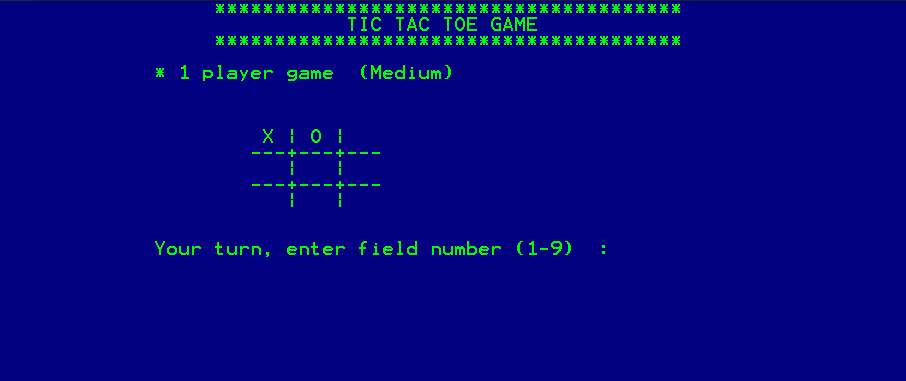

# TicTacToe 

This is an console application of TicTacToe game.

## Install and open
Clone the repository and open .sln file in Microsoft Visual Studio. Then run the application.

## Features and options

- single player mode (playing with a computer)
- choice of character
- three levels of difficulty
- multiplayer mode

## Stack
C++

## Preview screenshot

